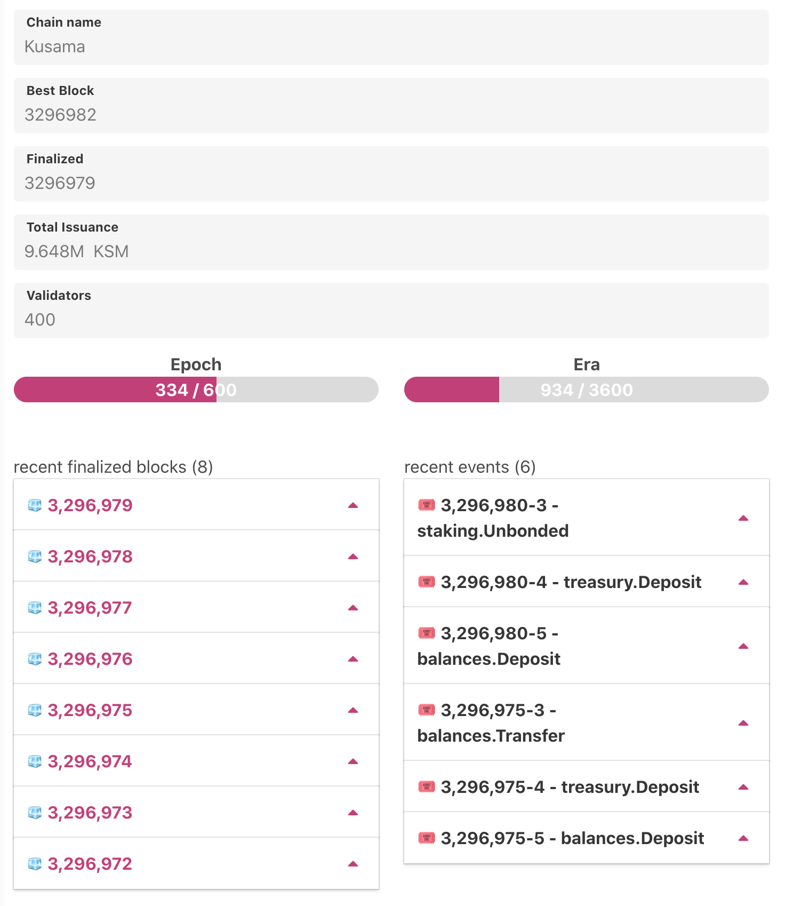
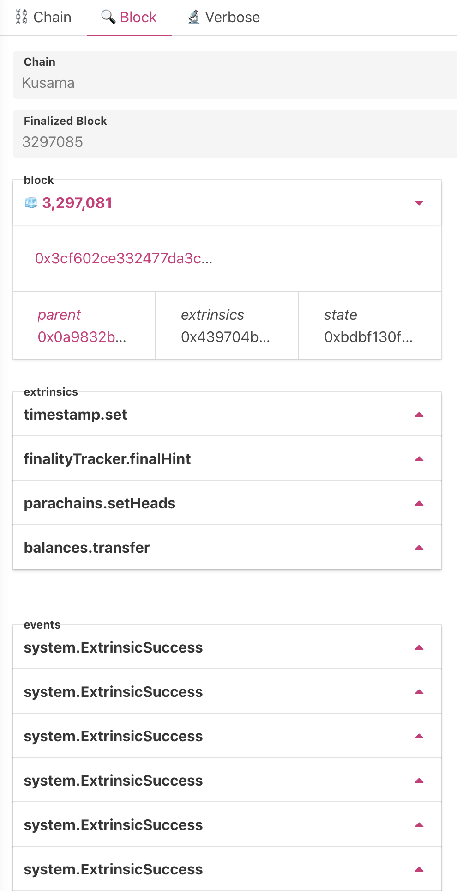

## Overview 👀  

Explore chain name, best block, finalized blocks, total isuance, number of validators, state of epoch & era, deep dive in too finalized blocks, see hash of parent block, extrinsics and state. Next to it explore events happening in extrinsics, i.e. treasury deposit, balance transfers, council votes, democracy events and various governance drive

## Chain Info

Here you can see 
* name of chain you are connected to
* best block we have from our node
* finalized block at our node
* total issuance rate of network
* number of validators
* state of Epoch & Era
* recent finalized blocks
* recent events (extrinsics & On-chain)

## Block Details 

Details of particular block.

* block number
* hash of block
* parent hash of block
* extrinsics hash
* state root hash

Various extrinsics and events in that particular block

## Node Info

At time of writing, [it doesn't work as API has changed](https://github.com/polkadot-js/apps/issues/3250)

Supposed look
- [Demo1](https://twitter.com/KodaDot/status/1254323912047017984) 
- [Demo2](https://twitter.com/yangWao/status/1258089776776908802)