## Overview 👀

Democracy page consist of five sub-pages:

- Overview
- Actions
- Targets
- Waiting
- Payouts

## Overview

The overview is divided into two parts: **Summary** and **Validators**

The summary is a small dashboard with all important information such as validators count, nominators count, actual era, and many others

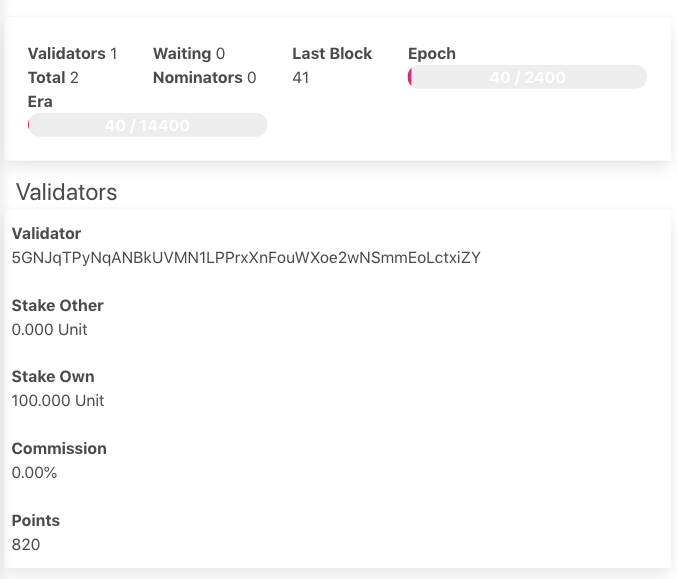

In the validators, the user is able to see info about validators on the selected network. As an example users can see how much currency the actual validator staked, the commission of the current validator.

## Actions

The actions tab shows a list of available stashes

As we can see on the image below each stash consist of
stash address, controller address, reward destination, bonded funds, commission, and session keys.

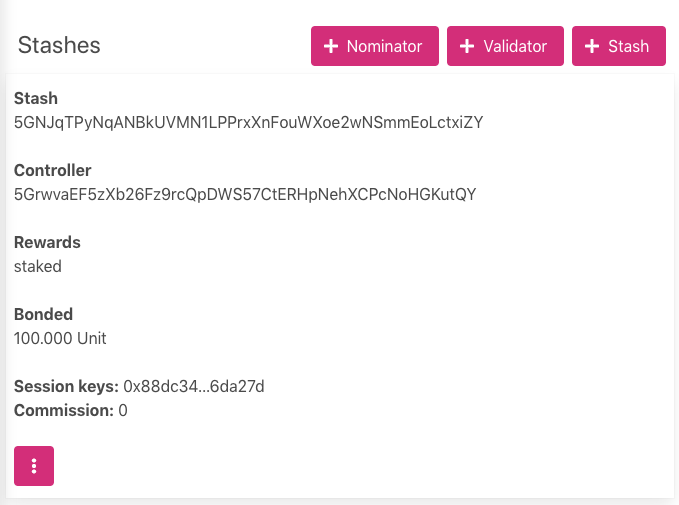

Moreover, clicking on the`⋮` button user are able to see actions available for the stash.

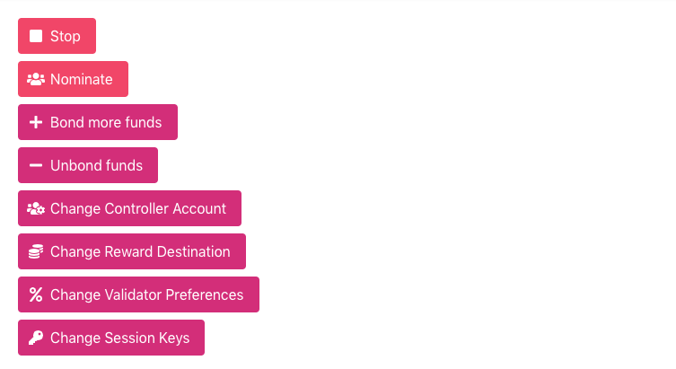

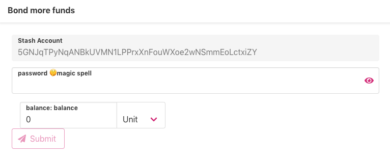

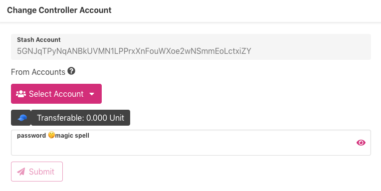

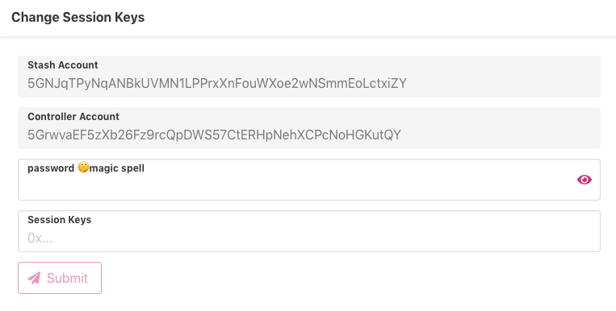

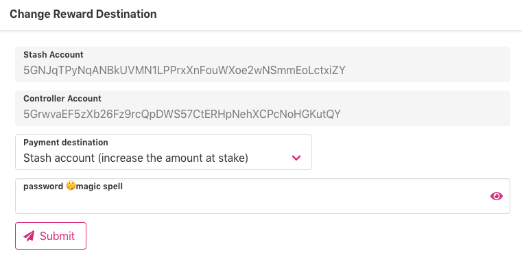

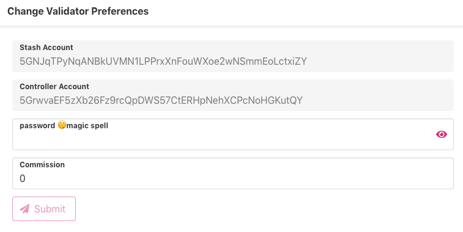

Users are also able to add a new nominator using the `+ Nominator` button.
On the first image below the user selects account for the stash, account for the controller, funds to nominate, and reward destination.
If the stash account is protected by a password, the user has to also type a password.

> User is able to choose the same account for stash and controller, however, it's not recommended.

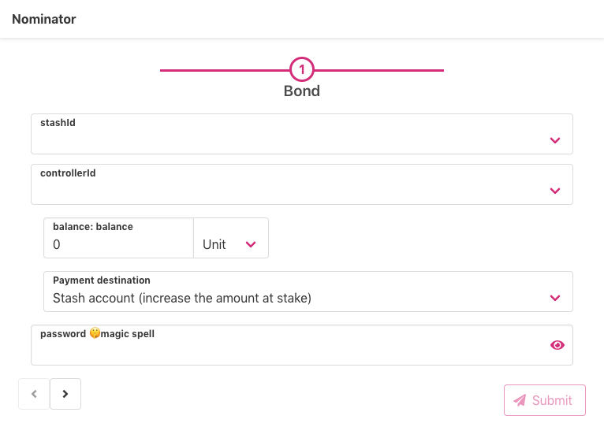

On the second screen shown below the user is able to select validator accounts.

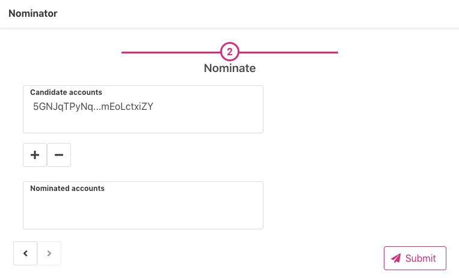

Using the `+ Validator` button user can add a new validator. 

The first screen for adding a validator is the same as the first page of adding a nominator.

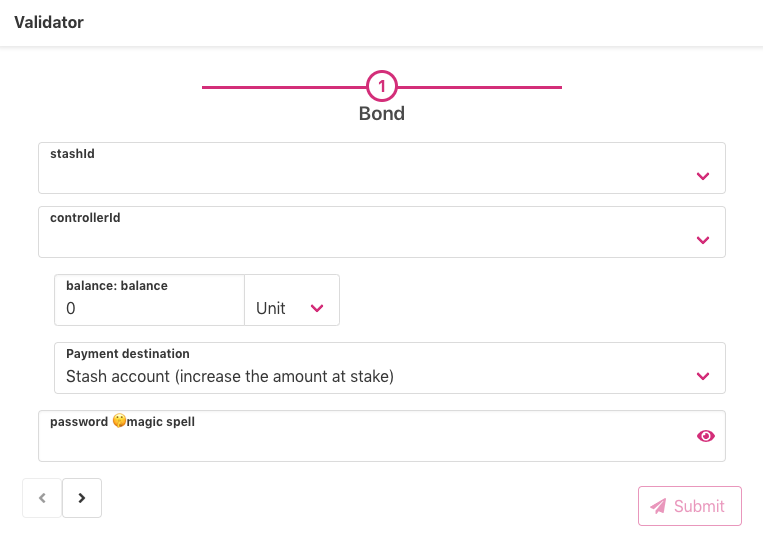

The second screen allows the user to set session keys and commission.
Clicking on the green `Generate` button, function `author_rotateKeys` is called, which generates session keys for the user.

> author_rotateKeys is considered as unsafe RPC method.

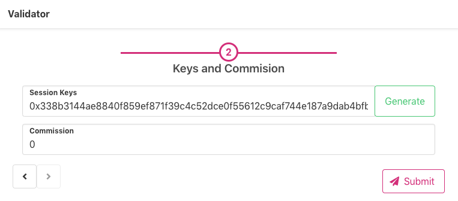

## Targets

Targets tab is the list of actual validators.

Same as an overview, targets consist of vital information about validators,

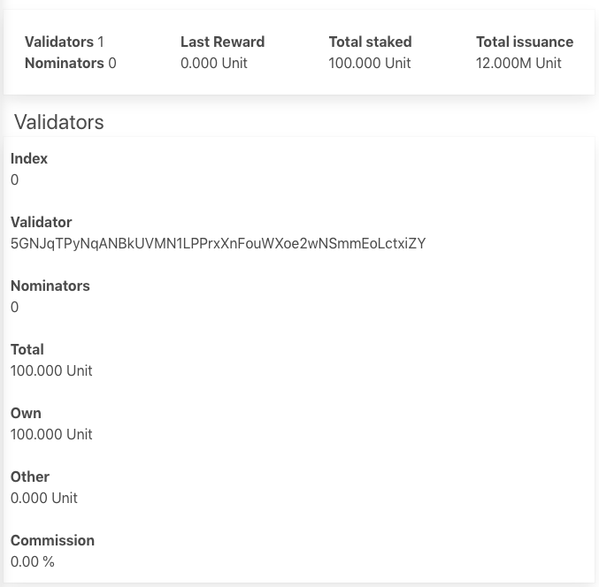

## Waiting

The waiting tab shows a list of waiting validators to be approved.

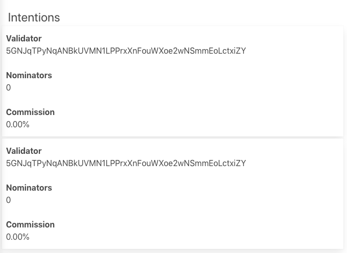

## Payouts

The payouts tab shows a list of stakers eligible to claim rewards for past eras. 

> For more info about payouts https://wiki.polkadot.network/docs/en/learn-simple-payouts

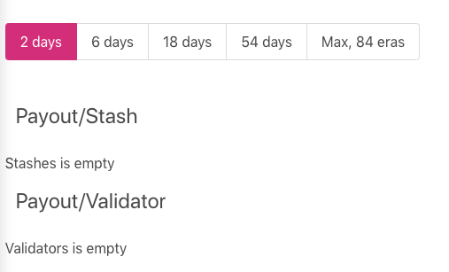