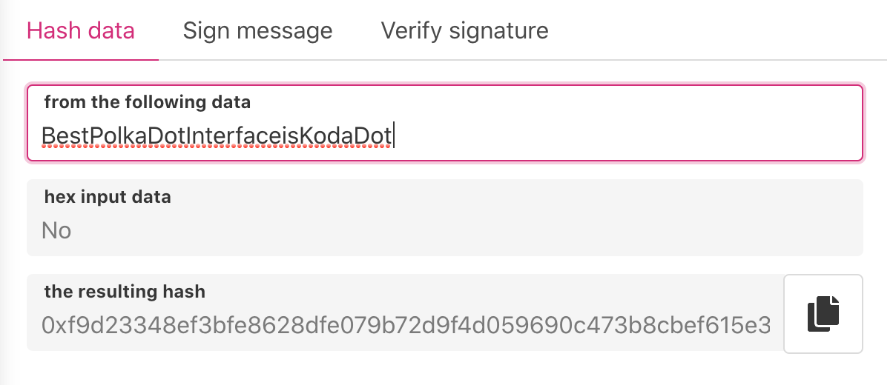
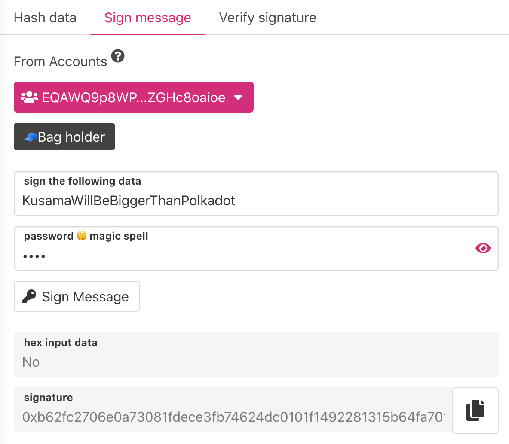
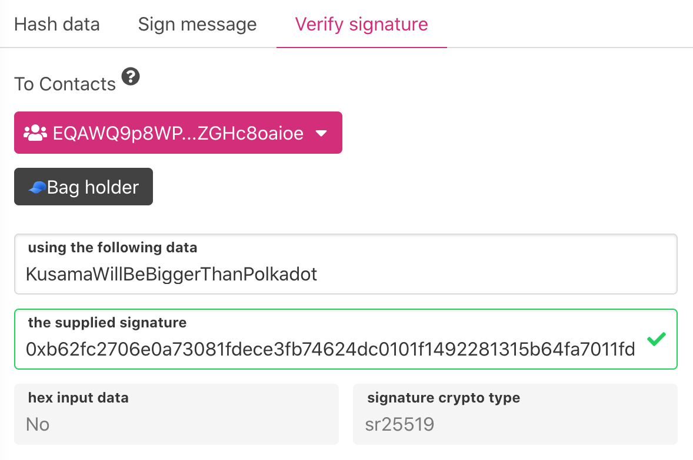

## Overview 👀         

Utility hashing functions like Sign, Verify with accounts and hash data. 

## Hash Data

With hash data you can hash any input to hex. It has field which detects if input data is hex. Could be helpful if you are not sure.

## Sign Message 

If you want pass someone imporant message and want to proof it was made by your account. You just need add data, i.e. when you want verify your identity for registrar, add password to unlock and sign message.

Copy signature and pass it to other party.

## Verify Signature

You want to verify that Signature was created by particular address. You need input data and signature. It will automatically signalize by green field it's match and show signature crypto type

